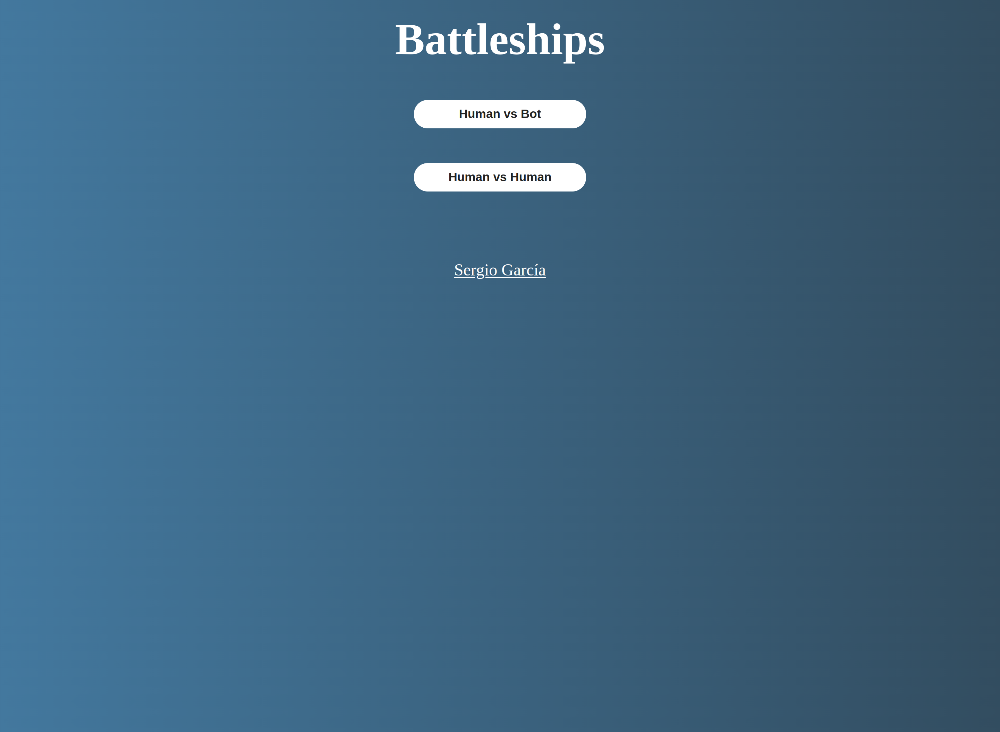

# Battleship

A battleship game created with JavaScript to practice testing

## About the Game

This project is from [The Odin Project](https://www.theodinproject.com/lessons/node-path-javascript-battleship) curriculum.

### Features

- It has one player and two players mode
- The bot try adjacent slots after getting a ‘hit’
- It's support responsive design

### Tools and technology

- Visual Studio Code
- Linux Terminal
- Figma
- Git and GitHub
- HTML and CSS
- JavaScript
- Webpack
- Jest

## Screenshot

### Main menu

### Game in action

### Responsive

  
   

## Acknowledgements

- Project idea by [The Odin Project](https://www.theodinproject.com/)
- Web icon from [favicon](https://favicon.io/)

## Author

[Sergio García](https://github.com/sergiogarciiam)

## License

This project is open source and available under the [MIT License](./LICENSE).
